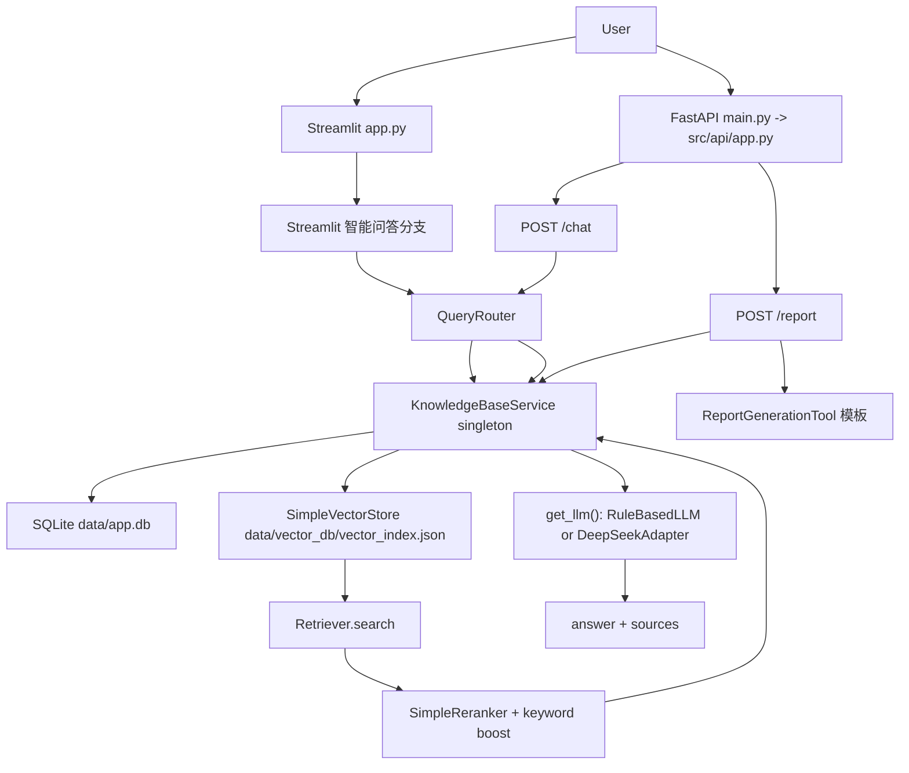

# 项目工程审计报告

审计日期：2026-06-17

项目：基于 Agentic RAG 的企业级多模态知识库 Agent 系统

本轮按 `codex待执行任务.txt` 执行，只做审计、诊断脚本和报告，不重构业务逻辑，不输出任何真实 API Key。

## 0. 审计结论摘要

当前项目可以运行，`pytest` 结果为 `75 passed, 1 warning`，但“测试通过”不能等同于“真实 Demo 可用”。核心原因如下：

- 当前 Streamlit 与 FastAPI 都直接 import `src.*` 服务，但 Streamlit 没有通过 HTTP 调用 FastAPI；两边流程相似但不是完全同一条入口链。
- 当前真实问答链路主要是 `QueryRouter -> KnowledgeBaseService.query() -> Retriever -> Reranker -> RuleBasedLLM/DeepSeekAdapter`。
- 项目里没有 `ModelFactory` 类，只有 `create_chat_model()` 和 `get_model_status()` 函数；任务文件给出的 `ModelFactory().get_model_status()` 命令在当前代码中会 ImportError。
- 当前没有根目录 `.env`，未配置 `DEEPSEEK_API_KEY`，模型状态为 `MockLLM / RuleBasedLLM`。因此不能声称已经真实调用大模型。
- `KnowledgeBaseService.query()` 会构造 context 并调用 `LLMService.generate_with_context()`，但默认 LLM 是规则引擎；`RagPipeline.query()` 自身仍是模板拼接，不调用 LLM。
- FastAPI `/report` 只做知识库检索 + 模板报告生成，不调用 LLM。Streamlit 报告页会调用 LLM，但默认是 RuleBasedLLM，并且会回退模板。
- 检索依赖字符 trigram hash embedding + 关键词窗口加权，没有真实语义能力。诊断脚本复现：`电池有什么风险？` 命中候选但 final_score=0.0799，小于阈值 0.10，被拒答且不调用 LLM。
- 当前 `data/app.db` 中 `documents=0, chunks=0`，但 `data/vector_db/vector_index.json` 有 1 条 `guide.txt` 向量，数据库和向量库已不一致。
- `tests/test_rag_pipeline.py` 中 `RagPipeline()` 使用默认持久化路径，运行测试会污染真实 `data/vector_db/vector_index.json`，这是已确认问题。

## 1. 当前项目真实入口

### FastAPI 入口

- 根入口：`main.py:3`，导出 `src.api.app.app`。
- FastAPI 工厂：`src/api/app.py:16-31`。
- 已注册路由：`/health`、`/chat`、`/upload`、`/knowledge_base`、`/memory`、`/feedback`、`/report`。
- 正式后端启动方式应为类似：

```powershell
venv\Scripts\python.exe -m uvicorn main:app --reload
```

### Streamlit 入口

- 入口文件：`app.py`。
- 页面包括：项目介绍、智能问答、文档上传、知识库管理、长期记忆、表格分析、报告生成。
- 启动方式应为类似：

```powershell
venv\Scripts\streamlit.exe run app.py
```

### 两者是否调用同一套核心服务

结论：部分共享，但入口链不统一。

- Streamlit 直接 import `src.models.model_factory.get_model_status()`：`app.py:10-13`。
- Streamlit 直接 import `src.rag.knowledge_base_service.get_kb_service()`：`app.py:33-39`。
- Streamlit 智能问答直接 import `QueryRouter` 并调用 `kb.query()`：`app.py:89-109`。
- FastAPI `/chat` 也直接 import `QueryRouter`、`get_kb_service()`、`get_llm()`：`src/api/routes_chat.py:12-16`。

风险：Streamlit 没有走 FastAPI HTTP 层，因此不会验证真实 API 行为、请求/响应 schema、中间件、错误处理，也可能因缓存和进程差异导致与 FastAPI 状态不一致。

### 当前真实调用链路图



注意：`src/agents/react_agent.py` 中存在 `AgenticRagAgent`，但当前 `app.py` 和 FastAPI `/chat` 都没有调用 `get_agent()`。`src/rag/rag_pipeline.py` 也主要被 `react_agent.py` 和测试引用，不是当前真实 Web 入口的主链路。

## 2. 当前 RAG Chain 是否真实存在

### 已确认

存在一条轻量 RAG 链：

```text
KnowledgeBaseService.query()
-> Retriever.retrieve()
-> SimpleReranker.rerank()
-> keyword boost
-> source filtering
-> _summarize_with_llm()
-> get_llm().generate_with_context(question, context)
```

关键代码：

- 检索：`src/rag/knowledge_base_service.py:356-361`
- 关键词增强：`src/rag/knowledge_base_service.py:362-369`
- content_type 过滤：`src/rag/knowledge_base_service.py:370-387`
- 调用 LLM 总结：`src/rag/knowledge_base_service.py:403-405`
- 构造 context 并调用 `generate_with_context()`：`src/rag/knowledge_base_service.py:434-455`

### 不存在或不完整

- 未发现任务中提到的 LangChain 风格链式结构：

```python
chain = self.prompt_template | print_prompt | self.model | StrOutputParser()
```

- `config/prompt_templates.yaml` 中存在 `rag_qa`、`report_generation` 等模板，但当前 `KnowledgeBaseService._summarize_with_llm()` 没有读取这些模板，而是手写 context。
- 未使用 `StrOutputParser` 或类似输出解析器。
- `src/rag/rag_pipeline.py` 的 `_build_answer()` 是模板拼接：`src/rag/rag_pipeline.py:184-238`，不调用 LLM。

### 结论

当前“真实 Web 问答链路”有 `prompt/context + LLMService` 的雏形，但不是原始 LangChain chain；在没有真实 key 时，输出仍由 `RuleBasedLLM` 规则提取完成，用户会感到不像大模型总结。

## 3. 当前大模型是否真的可调用

### 配置现状

- 当前根目录没有 `.env`。
- `.env.example` 中定义了 `DEEPSEEK_API_KEY=your_deepseek_api_key_here`：`.env.example:7`。
- `settings.py` 调用 `load_dotenv()`：`src/core/settings.py:10-13`。
- `settings.py` 读取 `DEEPSEEK_BASE_URL` 和 `CHAT_MODEL_NAME`：`src/core/settings.py:54-62`。
- `settings.py` 没有 `deepseek_api_key` 字段，真实 key 由 `model_factory.py` 直接读 `os.getenv("DEEPSEEK_API_KEY")`。

### 模型选择逻辑

- `DeepSeekAdapter` 初始化时读取 `DEEPSEEK_API_KEY`：`src/models/model_factory.py:24-35`。
- `create_chat_model()` 在 key 存在且不是 placeholder 时返回 `DeepSeekAdapter`：`src/models/model_factory.py:81-93`。
- `get_model_status()` 只检查 key 和 `openai` 包是否可 import，不实际发起 API 调用：`src/models/model_factory.py:96-110`。
- `get_llm()` 在环境变量存在时调用 `create_chat_model()`，否则返回 `RuleBasedLLM`：`src/models/llm_service.py:173-185`。

### 诊断命令结果

任务指定命令：

```powershell
venv\Scripts\python.exe -c "from src.models.model_factory import ModelFactory; print(ModelFactory().get_model_status() if hasattr(ModelFactory(), 'get_model_status') else 'no get_model_status')"
```

当前结果：失败，因为 `src.models.model_factory` 中不存在 `ModelFactory` 类。

按当前实际代码调整后运行：

```powershell
venv\Scripts\python.exe -c "from src.models.model_factory import get_model_status; print(get_model_status())"
```

输出：

```text
{'model_type': 'MockLLM', 'model_name': 'RuleBasedLLM', 'is_mock': True, 'status': 'MockLLM模式 - 配置DEEPSEEK_API_KEY到.env可切换真实大模型'}
```

### 结论

当前未真实调用 DeepSeek。项目具备 DeepSeekAdapter 代码路径，但当前 `.env` 不存在，`DEEPSEEK_API_KEY` 未配置，因此只能使用 `RuleBasedLLM`。

## 4. 当前 Streamlit 是否绕过 FastAPI

结论：是。Streamlit 绕过 FastAPI，直接调用 `src` 服务。

证据：

- 智能问答页面直接 `from src.agents.query_router import QueryRouter`：`app.py:89`
- 直接 `kb = get_kb_service()`：`app.py:92`
- 知识问答直接 `kb.query()`：`app.py:109`
- 上传页面直接写 `settings.raw_documents_dir` 并 `kb.ingest_file(dest)`：`app.py:136-153`
- 知识库管理直接调用 `kb.clear()`、`kb.rebuild_index()`：`app.py:236-250`
- 报告生成直接 `kb.query()`、`get_llm()` 和 `ReportGenerationTool()`：`app.py:321-338`

风险：

- 前端没有验证 FastAPI `/chat`、`/upload`、`/report` 的真实可用性。
- Streamlit 和 FastAPI 虽然都使用 `get_kb_service()`，但如果作为不同进程启动，会各自有自己的 Python 单例缓存；磁盘路径相同，但内存 vector store 状态可能不同步。
- Streamlit 上传后 FastAPI 进程中的 `SimpleVectorStore` 不一定自动 reload，反之亦然。
- Streamlit 的报告逻辑和 FastAPI `/report` 逻辑不同，用户在两个入口看到的能力不一致。

## 5. 当前检索机制是否可靠

### 机制说明

- 默认 embedding 是 `MockEmbedding`，基于中文/英文字符 trigram 的 MD5 哈希映射到 128 维向量：`src/rag/embedding_service.py:18-45`。
- `SimpleVectorStore.search()` 用 embedding 余弦相似度检索：`src/rag/vector_store.py:81-103`。
- `SimpleReranker` 使用正则 token 集合做 Jaccard 重排序：`src/rag/reranker.py:42-58`。
- `KnowledgeBaseService.query()` 又使用 `_extract_keywords()` 生成英文 token + 中文 2/3/4 字滑动窗口，并做 `0.3 * rerank_score + 0.7 * keyword_score`：`src/rag/knowledge_base_service.py:362-369`、`src/rag/knowledge_base_service.py:488-519`。
- 默认阈值 `rag_similarity_threshold=0.10`：`src/core/settings.py:65-68`。

### 诊断复现

新增脚本 `scripts/diagnose_rag_chain.py` 使用临时 DB 和临时 vector store 入库最小文档：

```text
低温快充可能导致负极析锂风险增加。原因是在低温环境下锂离子扩散能力下降，电荷转移阻抗增大，极化加剧。
```

运行结果摘要：

| query | keyword_score | vector_score | final_score | evidence | LLMService |
| --- | ---: | ---: | ---: | ---: | --- |
| 低温快充可能带来什么风险？ | 0.4333 | 0.3223 | 0.3710 | 1 | called |
| 低温有什么影响？ | 0.0667 | 0.2635 | 0.1020 | 1 | called |
| 电池有什么风险？ | 0.0667 | 0.1581 | 0.0799 | 0 | not called |
| 这份文档中提到的电池价格是多少？ | 0.0000 | 0.1035 | 0.0217 | 0 | not called |

这解释了用户实测现象：

- “低温快充”是连续短语，trigram 和关键词窗口都容易命中。
- “低温”还能勉强过阈值，final_score=0.1020。
- “电池”没有出现在测试文档中，虽然用户语义上问的是电池风险，但当前检索没有概念扩展能力，final_score=0.0799，被阈值过滤。
- MockEmbedding 不是语义模型，不能理解“析锂/快充/低温”都属于电池安全语义域。

### content_type 和 CSV 污染

- 入库时 `.csv` 被分类为 `table_knowledge`：`src/rag/knowledge_base_service.py:103-109`。
- CSV 会被转换成摘要，而不是原始行 chunk：`src/rag/knowledge_base_service.py:281-289`、`src/rag/knowledge_base_service.py:296-343`。
- 问答时 `prefer_content_type="text_knowledge"` 会过滤非文本知识：`src/rag/knowledge_base_service.py:382-385`。

高概率风险：

- 旧向量记录 metadata 缺失 `content_type` 时会被当作 `text_knowledge`，可能污染普通问答。
- 当前真实 `vector_index.json` 中已有 1 条 `guide.txt`，metadata `content_type` 为空。

## 6. 当前报告生成是否真正使用 LLM

### FastAPI `/report`

结论：没有真正调用 LLM。

证据：

- `/report` 入口：`src/api/routes_report.py:18-50`
- 会调用 `kb.query(request.topic, top_k=5)`：`src/api/routes_report.py:24-27`
- 但最终使用 `ReportGenerationTool.generate()` 模板生成：`src/api/routes_report.py:45-50`
- `ReportGenerationTool` 明确是模板工具：`src/tools/report_generation_tool.py:13-20`
- 模板缺省内容在 `_placeholder_content()` 中硬编码：`src/tools/report_generation_tool.py:102-120`

### Streamlit 报告页

结论：会调用 LLM，但默认仍是 RuleBasedLLM，且存在模板回退。

证据：

- Streamlit 报告页检索知识库：`app.py:321-323`
- 构造 prompt 并 `llm.generate(prompt)`：`app.py:331-335`
- 再调用模板工具：`app.py:337-338`
- 只有当 `llm_answer` 长度大于 100 才替换模板内容：`app.py:340-342`

### 结论

用户感觉“报告不像大模型总结”是合理的。FastAPI 报告接口没有 LLM，Streamlit 默认也是规则 LLM 或模板回退。

## 7. 当前测试是否可信

### 已运行结果

```powershell
venv\Scripts\python.exe -m pytest -q
```

结果：

```text
75 passed, 1 warning in 1.61s
```

警告：FastAPI TestClient/Starlette httpx deprecation。

### 覆盖内容

- 配置检查：`.env.example` 不含真实 key、settings 可加载。
- FastAPI `/health` 基础测试：`tests/test_health.py:6-15`。
- SQLite CRUD：`tests/test_database.py`。
- QueryRouter/TaskPlanner/ToolSelector/AnswerVerifier 单元测试：`tests/test_agent_router.py`。
- MockEmbedding、SimpleVectorStore、Retriever、Reranker、RagPipeline：`tests/test_rag_pipeline.py`。
- KnowledgeBaseService 临时库入库和检索：`tests/test_upload_ingestion.py`。
- 报告模板生成：`tests/test_report_generation.py`。
- 旧污染防护的局部测试：`tests/test_rag_no_old_pollution.py`。
- 记忆和工具测试。

### 关键缺口

- 没有启动 Streamlit，也没有 Playwright/页面级测试。
- 没有测试 Streamlit 是否通过 FastAPI，事实上它没有。
- 没有真实 DeepSeek API 调用测试。
- 没有测试 `.env` 配置后 `DeepSeekAdapter.generate()` 是否成功。
- 没有端到端覆盖：上传 -> 入库 -> 检索 -> prompt/context 构造 -> LLM 调用 -> 输出。
- `/report` 测试只验证模板段落，不验证 LLM 调用。
- `RagPipeline` 测试断言宽松：`evidence_count >= 1 or confidence == "low"`，不能证明 RAG 质量。
- `tests/test_rag_pipeline.py` 中 `RagPipeline()` 使用默认路径并持久化，会污染真实 `data/vector_db/vector_index.json`。

## 8. 当前数据库和向量库是否一致

### 配置路径

- SQLite 默认路径：`settings.sqlite_db_path = <project>/data/app.db`，来自 `src/core/settings.py:49-51`。
- vector index 默认路径：`settings.vector_db_dir = <project>/data/vector_db`，实际文件为 `data/vector_db/vector_index.json`，来自 `src/core/settings.py:44-46`、`src/rag/vector_store.py:47-52`。
- SQLiteManager 默认使用 `settings.sqlite_db_path`：`src/database/sqlite_manager.py:19-22`。
- KnowledgeBaseService 默认同时使用 `get_db()` 和 `SimpleVectorStore(settings.vector_db_dir)`：`src/rag/knowledge_base_service.py:80-88`。

### 当前真实数据状态

本次审计查询结果：

```text
data/app.db exists: True
documents: 0
chunks: 0
conversations: 0
memories: 12
feedback: 0
tool_logs: 0
error_cases: 0
HASH_NA: 0
DUP_HASH_GROUPS: 0

data/vector_db/vector_index.json exists: True
VECTOR_DOCS: 1
CONTENT_TYPES: ['']
FILENAMES: ['guide.txt']
```

结论：当前数据库和向量库不一致。DB 没有文档和 chunk，但向量库有 1 条 `guide.txt`。这会导致知识库状态、删除、去重、检索来源出现不一致。

已确认污染来源：运行测试后，`tests/test_rag_pipeline.py:127-128` 使用默认 `RagPipeline()` 并 `ingest_directory(tmp_path)`，`RagPipeline` 默认使用真实 `data/vector_db`，且 `ingest_directory()` 会 persist：`src/rag/rag_pipeline.py:140-142`。

## 9. 是否存在旧代码路径污染

### 目录层面

本次检查：

```text
rag=False
agent=False
model=False
src=True
config=True
docs=True
data=True
```

根目录没有 `rag/`、`agent/`、`model/` 三套旧源码目录。

### 代码路径层面

存在多条并行但不等价的业务路径：

- `KnowledgeBaseService.query()`：当前 Web 入口真实使用的 RAG 问答路径。
- `RagPipeline.query()`：`AgenticRagAgent` 和测试使用，内部不调用 LLM。
- `AgenticRagAgent.execute()`：看起来是完整 9 步 Agentic 编排，但当前 `app.py` 和 FastAPI `/chat` 未使用。
- FastAPI `/report`：模板报告路径。
- Streamlit 报告页：LLM + 模板混合路径。

风险：用户或测试容易把 `AgenticRagAgent`/`RagPipeline` 的存在误认为 Web Demo 已使用完整 Agentic RAG，但真实入口没有走这条链。

## 10. 距离真正 RAG 大模型应用的关键差距

1. 入口统一：Streamlit 应明确走 FastAPI 或抽出共享 application service，否则前后端行为难以一致验证。
2. 真实模型：需要可验证的 DeepSeek 配置和最小真实调用诊断。
3. Chain 规范化：需要统一 `PromptTemplate + context + LLM + output parser` 的真实链路，避免一处模板、一处规则、一处自定义 context。
4. 检索质量：MockEmbedding 不具备语义能力，需要真实 embedding 或至少 BM25/中文分词。
5. 数据一致性：DB 和 vector index 必须同生命周期管理，测试不能写真实 `data/`。
6. 报告生成：FastAPI `/report` 需要和问答一样走检索 + prompt + LLM，而不是只调用模板。
7. 可观测性：前端需要显示 route、model_type、sources、score、prompt/context 摘要，方便排查。
8. 测试真实性：需要覆盖真实入口和最小真实 LLM 配置路径。

## 11. 新增诊断脚本

### `scripts/diagnose_rag_chain.py`

用途：使用临时 SQLite 和临时 vector index 入库最小文档，打印：

- cwd
- settings 数据库路径、vector_db 路径
- 当前 LLM 类型
- 是否检测到 `DEEPSEEK_API_KEY`，不输出 key
- query
- route
- retrieved sources
- content snippet
- keyword_score
- vector_score
- rerank_score
- final_score
- constructed prompt 前 1000 字
- model_type
- 是否调用 LLMService
- final answer

运行：

```powershell
venv\Scripts\python.exe scripts\diagnose_rag_chain.py
```

本次运行成功，并复现 `电池有什么风险？` 因 final_score 低于阈值而无证据、未调用 LLMService。

### `scripts/diagnose_llm_config.py`

用途：检查：

- `.env` 是否存在
- `DEEPSEEK_API_KEY` 是否存在、非空、placeholder
- settings 是否有 key 字段
- ModelFactory 类是否存在
- `get_model_status()` 当前模型状态
- `create_chat_model()` 和 `get_llm()` 选择的 provider
- 如有真实 key，执行最小 LLM 调用

运行：

```powershell
venv\Scripts\python.exe scripts\diagnose_llm_config.py
```

本次运行结果：

```text
.env exists: False
DEEPSEEK_API_KEY exists: False
settings has deepseek_api_key field: False
model_type: MockLLM
create_chat_model selected: RuleBasedLLM
LLMService provider: RuleBasedLLM
当前未配置 DEEPSEEK_API_KEY，因此系统只能使用 MockLLM，报告生成不会调用真实大模型。
```

## 12. 问题分级

### 已确认问题

- 根目录 `.env` 不存在，未配置 `DEEPSEEK_API_KEY`。
- 当前模型状态为 MockLLM/RuleBasedLLM。
- `ModelFactory` 类不存在，任务中的诊断命令不适配当前代码。
- Streamlit 绕过 FastAPI，直接调用 `src` 服务。
- FastAPI `/report` 不调用 LLM，只使用模板。
- `RagPipeline.query()` 不调用 LLM。
- `AgenticRagAgent` 不是当前 Web 入口真实链路。
- 当前 DB 和 vector index 不一致。
- 测试会污染真实 `data/vector_db/vector_index.json`。
- 短关键词 `电池有什么风险？` 在最小诊断文档下被阈值过滤，未进入 LLMService。

### 高概率问题

- 旧 vector metadata 缺失 `content_type` 会被当作 `text_knowledge`，污染普通问答。
- Streamlit 和 FastAPI 多进程运行时，内存中的 `SimpleVectorStore` 单例不同步。
- `get_model_status()` 不实际调用 API，可能显示“真实大模型模式”但真实调用仍失败。
- 报告生成在 Mock 模式下长度达到阈值时可能被误认为 LLM 报告。

### 需要用户确认的问题

- 是否希望 Streamlit 必须通过 FastAPI HTTP API 调用，还是保留本地直连但抽共享 service。
- 是否已有真实 DeepSeek key，但没有放在当前项目根目录 `.env`。
- 是否允许下一阶段清理当前 `data/vector_db/vector_index.json` 与 `data/app.db` 的不一致状态。

### 建议立即修复的问题

- 测试隔离真实 `data/`，避免再次污染 vector index。
- 统一 Streamlit 与 FastAPI 的问答和报告调用路径。
- 报告生成接入真正 `LLMService`，并在 Mock 模式明确提示。
- 增加真实链路诊断/集成测试，验证 LLMService 是否被调用。
- 改进中文短关键词检索和阈值策略。

### 需要后续设计的问题

- 真实 embedding、ChromaDB、BM25、jieba/THULAC 等中文分词方案。
- 多用户知识库隔离。
- 生产部署、认证、VLM、多模态表格抽取。

## 13. P0/P1/P2 修复计划

### P0 必须修复

1. 统一 Streamlit 与 FastAPI 调用链：优先让 Streamlit 调 FastAPI；或抽出同一个 application service，并确保两边完全复用。
2. 恢复/明确真实 RAG Chain：统一为 `retrieval -> prompt/context -> LLMService -> parser/output`，不要让 `RagPipeline` 和 `KnowledgeBaseService` 各走一套。
3. 打通 Prompt + Context + LLM 调用：报告、问答、文档总结都走同一套可观测链路。
4. 真实 LLM 配置可用性：增加 `.env` 检查、placeholder 检查、最小 API 调用检查，并区分“配置存在”和“调用成功”。
5. 修复关键词匹配：至少修正短中文 query 的 keyword_score/阈值问题，避免“电池”类查询无证据。
6. 报告生成真正使用 LLM：FastAPI `/report` 必须调用 `LLMService`，Mock 模式显式标识模板/规则输出。
7. 测试覆盖真实 Chain：新增端到端测试，断言 LLMService 被调用，断言构造 prompt/context，断言前端/后端路径一致。
8. 测试隔离数据路径：所有测试必须使用 tmp_path，不得写真实 `data/app.db` 或 `data/vector_db`。

### P1 建议修复

1. 接入真实 embedding。
2. 替换 MockEmbedding 或只在测试中使用。
3. 使用 ChromaDB 或其他可维护向量库，保证 metadata/filter/delete/rebuild 一致。
4. 改进中文分词，引入 jieba 或 BM25 分词策略。
5. 增加 BM25 或关键词检索，与向量检索做 hybrid search。
6. 前端展示 prompt/context 摘要、sources、model_type、route、score。
7. 增加错误提示：区分无 key、API 调用失败、检索无证据、vector/db 不一致。

### P2 后续优化

1. JWT 用户认证。
2. 企业微信/飞书 Bot。
3. 多用户知识库隔离。
4. 图片 VLM。
5. PDF 表格抽取。
6. 生产部署。

## 14. 是否建议进入下一步修复

建议进入下一步修复，但顺序必须先 P0 后 P1/P2。第一批最小补丁建议：

1. 修复测试污染真实 `data/vector_db` 的问题。
2. 统一或封装问答链路，让 FastAPI 和 Streamlit 使用同一个 service。
3. 让 `/report` 走 `LLMService`，并保留模板作为明确 fallback。
4. 增加 `DEEPSEEK_API_KEY` 真实调用诊断和端到端 Chain 测试。
5. 修复短中文关键词检索阈值和 scoring。
